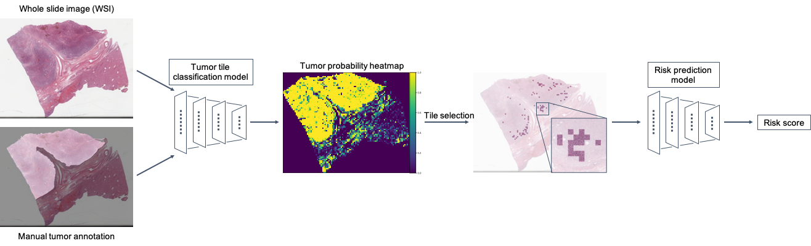

# HCCSurvNet: Deep learning predicts postsurgical recurrence of hepatocellular carcinoma from digital histopathologic images  
  
  

This repository contains the code to quantify risk scores for recurrence in patients with hepatocellular carcinoma from H&E-stained FFPE histopathology images.

## Software Requirements  
This code was developed and tested in the following settings.  
### OS  
- Ubuntu 18.04  
### GPU  
- Nvidia GeForce RTX 2080 Ti  
### Dependencies  
- python (3.6.10)  
- numpy: (1.18.1)  
- pandas (0.25.3)  
- pillow (7.0.0)  
- scikit-learn (0.21.3)  
- scikit-image (0.15.0)  
- scikit-survival (0.11)  
- opencv-python (4.1.2.30)  
- openslide-python (1.1.1)  
- staintools (2.1.2)  
- h5py (2.9.0)  
- pytables (3.5.1)  
- pytorch (1.4.0)  
- torchvision (0.5.0)  
  
## Installation  
  
Install [Miniconda](https://docs.conda.io/en/latest/miniconda.html#linux-installers) on your machine (download the distribution that comes with python3).  
  
After setting up Miniconda, install OpenSlide (3.4.1):  
```
apt-get install openslide-tools
```
Create a conda environment with environment.yml:
```
conda env create -f environment.yml
```  
Activate the environment:
```shell
conda activate hccsurvnet
```
  
## Demo  
### data collection  
Download diagnostic whole-slide images from [TCGA-LIHC project](https://portal.gdc.cancer.gov/projects/TCGA-LIHC) using [GDC Data Transfer Tool Client](https://gdc.cancer.gov/access-data/gdc-data-transfer-tool).  
```
gdc-client download -m gdc_manifest_tcga_lihc.txt
```
  
Download TCGA-CDR-SupplementalTableS1.xlsx from [Integrated TCGA Pan-Cancer Clinical Data Resource](https://gdc.cancer.gov/about-data/publications/PanCan-Clinical-2018) and rename it to metadata.csv.  
  
Get tumor region annotations on whole-slide images using [Aperio ImageScope](https://www.leicabiosystems.com/digital-pathology/manage/aperio-imagescope/) in XML format.  
  
### prepare dataset for tumor tile classification  
```
python xml2tile.py  
python xml_tile2hdf.py  
```
  
### train and evaluate tumor tile classifier  
```
python tumor_tile_classifier.py
```
*** Output: AUROC (areas under the receiver operating characteristic curve) and its 95% confidence interval

### prepare dataset (TCGA-HCC) for risk score prediction  
```
python svs2tile.py  
python svs_tile2hdf.py  
```
  
### apply tumor tile classifier to the TCGA-HCC dataset  
```
python tumor_tile_inference.py  
```
  
### select top-X tiles (Default: X=100)  
```
python select_topX.py  
```
  
### train and evaluate risk score predictor  
```
python risk_score_predictor.py  
```
*** Output: Harrell's and Uno's C-indices  

Note: please edit paths in each .py file.  
  
## License  
This code is made available under the MIT License.  
  
## Citation  
  
[Scientific Reports 2021;11(1):2047](https://doi.org/10.1038/s41598-021-81506-y)  
  
```
@ARTICLE{Yamashita2021deep,
  title = "Deep learning predicts postsurgical recurrence of hepatocellular carcinoma from digital histopathologic images",
  author = "Yamashita, Rikiya and Long, Jin and Saleem, Atif and Rubin, Daniel L and Shen, Jeanne",
  journal  = "Sci. Rep.",
  volume   =  11,
  number   =  1,
  pages    = "2047",
  month    =  jan,
  year     =  2021,
  language = "en"
  }
```
